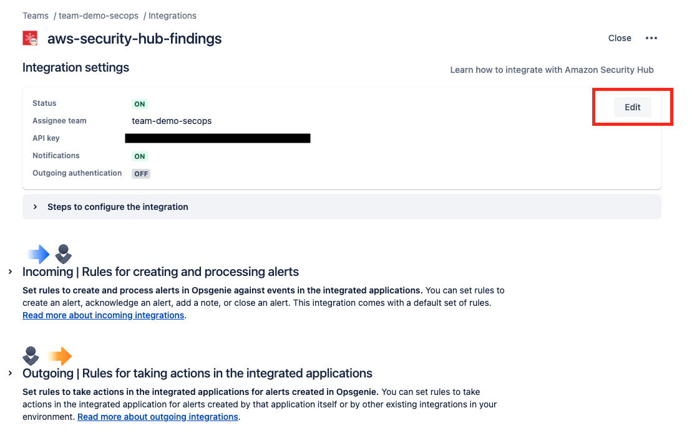

<!-- BEGIN_TF_DOCS -->

**Terraform Opsgenie Security Hub**

Nesse módulo, iremos configurar o [Opsgenie](https://www.atlassian.com/software/opsgenie) para receber findings do [AWS Security Hub](https://aws.amazon.com/security-hub/).

## Architecture

O AWS EventBridge é um serviço de integração de eventos. Ele permite que você capture eventos de várias fontes, incluindo serviços da AWS como o Security Hub, e os direcione para diferentes destinos, como o AWS SNS. Com o EventBridge, você pode criar regras que definem quais eventos devem ser capturados e para onde eles devem ser enviados. Nesse caso, estaremos criando uma regra para capturar eventos do Security Hub e os enviar para um tópico do SNS.

O AWS SNS é um serviço de mensagens e notificações que facilita a comunicação entre sistemas distribuídos. Ele permite que você publique mensagens para tópicos e que os assinantes desses tópicos recebam essas mensagens. No contexto desta integração, o SNS será usado para enviar notificações do Security Hub para o Opsgenie.

**Fluxo 1:**

Time de segurança manualmente triggando uma custom action no Security Hub para que os findings sejam enviados para o Opsgenie e um alerta seja aberto.

## Requirements

| Name | Version |
|------|---------|
|  [terraform](#requirement\_terraform) | >= 1.8 |
|  [opsgenie](#requirement\_opsgenie) | 0.6.37 |

## Providers

| Name | Version |
|------|---------|
|  [aws](#provider\_aws) | 5.70.0 |
|  [opsgenie](#provider\_opsgenie) | 0.6.37 |
|  [time](#provider\_time) | 0.12.1 |

## Modules

No modules.

## Resources

| Name | Type |
|------|------|
| [aws_cloudwatch_event_rule.security_hub_custom_action_opsgenie](https://registry.terraform.io/providers/hashicorp/aws/latest/docs/resources/cloudwatch_event_rule) | resource |
| [aws_cloudwatch_event_rule.security_hub_inspector_findings_ecr](https://registry.terraform.io/providers/hashicorp/aws/latest/docs/resources/cloudwatch_event_rule) | resource |
| [aws_cloudwatch_event_target.security_hub_custom_action_opsgenie](https://registry.terraform.io/providers/hashicorp/aws/latest/docs/resources/cloudwatch_event_target) | resource |
| [aws_cloudwatch_event_target.security_hub_inspector_findings_ecr](https://registry.terraform.io/providers/hashicorp/aws/latest/docs/resources/cloudwatch_event_target) | resource |
| [aws_iam_policy.this](https://registry.terraform.io/providers/hashicorp/aws/latest/docs/resources/iam_policy) | resource |
| [aws_iam_role.this](https://registry.terraform.io/providers/hashicorp/aws/latest/docs/resources/iam_role) | resource |
| [aws_iam_role_policy_attachment.this](https://registry.terraform.io/providers/hashicorp/aws/latest/docs/resources/iam_role_policy_attachment) | resource |
| [aws_securityhub_action_target.opsgenie](https://registry.terraform.io/providers/hashicorp/aws/latest/docs/resources/securityhub_action_target) | resource |
| [aws_sns_topic.this](https://registry.terraform.io/providers/hashicorp/aws/latest/docs/resources/sns_topic) | resource |
| [aws_sns_topic_policy.this](https://registry.terraform.io/providers/hashicorp/aws/latest/docs/resources/sns_topic_policy) | resource |
| [aws_sns_topic_subscription.this](https://registry.terraform.io/providers/hashicorp/aws/latest/docs/resources/sns_topic_subscription) | resource |
| [opsgenie_api_integration.aws_security_hub](https://registry.terraform.io/providers/opsgenie/opsgenie/0.6.37/docs/resources/api_integration) | resource |
| [opsgenie_team.this](https://registry.terraform.io/providers/opsgenie/opsgenie/0.6.37/docs/resources/team) | resource |
| [time_static.creation](https://registry.terraform.io/providers/hashicorp/time/latest/docs/resources/static) | resource |
| [aws_caller_identity.current](https://registry.terraform.io/providers/hashicorp/aws/latest/docs/data-sources/caller_identity) | data source |
| [aws_region.current](https://registry.terraform.io/providers/hashicorp/aws/latest/docs/data-sources/region) | data source |
| [opsgenie_user.users](https://registry.terraform.io/providers/opsgenie/opsgenie/0.6.37/docs/data-sources/user) | data source |

## Inputs

| Name | Description | Type | Default | Required |
|------|-------------|------|---------|:--------:|
|  [aws\_environment](#input\_aws\_environment) | Environment of AWS | `string` | n/a | yes |
|  [aws\_region](#input\_aws\_region) | Region of AWS | `string` | n/a | yes |
|  [opsgenie\_api\_key](#input\_opsgenie\_api\_key) | API Key of Opsgenie | `string` | n/a | yes |
|  [opsgenie\_team\_description](#input\_opsgenie\_team\_description) | Team description of Opsgenie | `string` | n/a | yes |
|  [opsgenie\_team\_name](#input\_opsgenie\_team\_name) | Team name of Opsgenie | `string` | n/a | yes |
|  [opsgenie\_users](#input\_opsgenie\_users) | Opsgenie list users and roles | `list(map(string))` | n/a | yes |

## Outputs

| Name | Description |
|------|-------------|
|  [aws\_account\_id](#output\_aws\_account\_id) | Selected AWS Account ID |
|  [aws\_region](#output\_aws\_region) | Details about selected AWS region |
|  [opsgenie\_security\_hub\_role\_arn](#output\_opsgenie\_security\_hub\_role\_arn) | ARN of the IAM Role created for Opsgenie Security Hub Integration |
|  [opsgenie\_security\_hub\_role\_name](#output\_opsgenie\_security\_hub\_role\_name) | Name of the IAM Role created for Opsgenie Security Hub Integration |

## Extras

### Opsgenie Integration

Após a execução do projeto, você terá que finalizar a configuração do Opsgenie. Para isso, siga os passos abaixo:

**Step 1:**

Acesse sua integração no Opsgenie e clique no botão de "Editar".

**Step 2:**

Selecione a opção de se autenticar com a conta do Amazon Security Hub.

**Step 3:**

Coloque a role criada pelo Terraform no campo de "Role ARN", selecione a região do seu Security Hub e clique em "Salvar".

Ao final desse processo você estará apto para receber os alertas do Security Hub no Opsgenie.

### Opsgenie Alerts Rules

Para customizar as mensagens dos alerts do Opsgenie, você deverá editar a regra de "Incoming" da sua integração, nesse caso, da Integração com o Security Hub.

No Opsgenie, você pode criar regras de alerta com lógicas condicionais personalizadas. Por exemplo:

- Definir ações específicas para alertas CRITICAL
- Definir ações específicas para alertas HIGH

Cada regra de alerta permite personalizar vários elementos:

- Mensagem
- Prioridade
- Tags
- Alias
- Descrição
- Entidade
- Notas

Para tornar seus alertas mais informativos e relevantes, o Opsgenie utiliza o conceito chamado [Dynamic fields](https://support.atlassian.com/opsgenie/docs/dynamic-fields-in-opsgenie-integrations/). Esses campos são usados para:

- Personalizar propriedades de alerta
- Ajustar condições de alerta com base em informações atualizadas

Usando campos dinâmicos, você pode criar alertas que se adaptam automaticamente às mudanças em seu ambiente, fornecendo informações mais precisas e úteis para sua equipe.

---

Dê uma ⭐️ para esse projeto se ele te ajudou!

 
 

Feito com 💜 por [mim](https://github.com/lpsm-dev) :wave: inspirado no [readme-md-generator](https://github.com/kefranabg/readme-md-generator)

(<a href="#readme-top">back to top</a>)

<!-- END_TF_DOCS -->